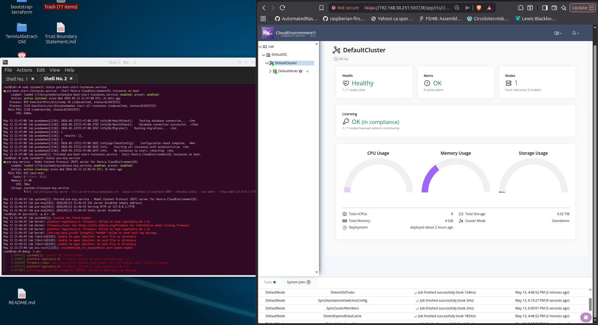

# Pextra OS Image Compatibility Test Report

This document outlines the process and results of a compatibility test performed on the Pextra OS image within a virtualized hypervisor environment.

**Objective:** Validate whether the OS image functions correctly when deployed on the main hypervisor.

**Compatibility Checks:** Verifying boot stability, network configuration, service initialization, and overall system responsiveness. Any issues, warnings, or crashes encountered during the process were reviewed through system logs and documented below where relevant.

**Reason:** The results of this assessment serve as a proof-of-concept for successful deployment and provide a baseline for determining whether the Pextra platform is suitable for further testing or production-level integration within the virtualized infrastructure.

## 1. Environment

**Hypervisor:** KVM (Linux virtualization)

**Operating System:** Debian 12 Bookworm (64-bit)

**VM Configuration:** Bridged networking on LAN (*192.168.50.0/24*)

**Storage:** Virtual disk (standard VM disk image)
- **SATA Port 0:** Pextra.vdi (Normal, 20.00 GB)

**Installation Type:** Pextra CE OSE ISO (lab deployment)
- **ISO:** pextra-ce-ose-1.0-amd64.iso
- **SHA256:** `965751a3c9d41209159546b2f46ff1386f7f4af0e44a40c16778c92671d65652  pextra-ce-ose-1.0-amd64.iso`
- **ISO.ASC:**
```
-----BEGIN PGP SIGNATURE-----

iHQEABYKAB0WIQT2yCSpW1EPSe1LDWQLT5BXx9vcQQUCaZTMWAAKCRALT5BXx9vc
QREmAPUeQxAMuQ/oEtjvHYS+uME1hxM1Mv8VVSKpcTBczJWNAQDPrPEXE7uYJ5Tn
Ijc6lQtHmZ5cFDQJ9qY1TzOCiQN4DA==
=bUi8
-----END PGP SIGNATURE-----
```
- **SHA256.ASC:**
```
-----BEGIN PGP SIGNATURE-----

iHUEABYKAB0WIQT2yCSpW1EPSe1LDWQLT5BXx9vcQQUCaZTMWAAKCRALT5BXx9vc
QVABAQCJhqDaLtdkRJN55naQtOWNK3F1KNw9rXWV9gdY4yM6+gEAqQ0/swWYE/lx
1eOjbvROahaTj9xzy9GJYqm3V/sOOQc=
=KxNP
-----END PGP SIGNATURE-----
```

**Graphics Controller:** VMSVGA

**Network:** Bridged Adapter, eno2

- **Adapter 1:** Intel PRO/1000 MT Desktop

## 2. Installation & Configuration

**Organization Name:** Lab

**Organization Description:** This is the default organization description created during the installation process for the lab.

**Country & TimeZone:** United States, Etc/Utc (UTC+0000)

**License Key:** 88124-\*\*\*\*\*-\*\*\*\*\*-\*\*\*\*\*-\*\*\*\*\*

**Username:** pceadmin

**Management Interface:** enp0s3

**Management IP:** 192.168.50.251/24

**Gateway:** 192.168.50.1

**DNS:** 1.1.1.1 (*Cloudflare*)

**Host:** lab.local

### Notes/Observations

**1.** OS image installed and booted successfully

**2.** Initial configuration completed (IP, DNS, gateway, organization, admin user)

**3.** Pextra dashboard is fully accessible and operational

**4.** No application-level crashes observed

## 3. Functional Testing

**Network connectivity:** OK (*VM reachable on LAN IP from different device*)

**Web dashboard:** OK (*UI loads and responds correctly, check image*)

**Basic system services:** check screnshot and section 5.

Running normally for approximately 1 hour with no spike in resource utilization or connection.

**Login/authentication:** Successful

- **Note:** Might want to check if a paid version is needed for dynamic ABAC features.
- **Note:** Depending on how IAM admin roles/access will be bootstrapped, compatibility with a vault or third-party secrets manager may need to be checked.

## 4. System Logs Review

**Command:** `sudo systemctl status pce-boot-start-instances.service`

```sh
● pce-boot-start-instances.service - Start Pextra CloudEnvironment(R) instances on boot
     Loaded: loaded (/lib/systemd/system/pce-boot-start-instances.service; enabled; preset: enabled)
     Active: active (exited) since Wed 2026-05-13 21:47:00 UTC; 1h 6min ago
    Process: 824 ExecStartPre=/bin/sleep 10 (code=exited, status=0/SUCCESS)
    Process: 1118 ExecStart=/usr/bin/pcedaemon start-all-instances (code=exited, status=0/SUCCESS)
   Main PID: 1118 (code=exited, status=0/SUCCESS)
        CPU: 938ms

May 13 21:47:00 lab pcedaemon[1118]: 2026-05-13T21:47:00.339Z info[db:HealthCheck]:    Testing database connection...  +1ms
May 13 21:47:00 lab pcedaemon[1118]: 2026-05-13T21:47:00.379Z info[db:HealthCheck]:    Database connection successful.  +35ms
May 13 21:47:00 lab pcedaemon[1118]: 2026-05-13T21:47:00.395Z info[db:Migrator]:    Running migrations...  +1ms
May 13 21:47:00 lab pcedaemon[1118]: {
May 13 21:47:00 lab pcedaemon[1118]:   results: [],
May 13 21:47:00 lab pcedaemon[1118]: }
May 13 21:47:00 lab pcedaemon[1118]: 2026-05-13T21:47:00.502Z info[app:CheckConfig]:    Configuration check complete.  +0ms
May 13 21:47:00 lab pcedaemon[1118]: 2026-05-13T21:47:00.503Z info:    Starting all instances with autostart=true  +1ms
May 13 21:47:00 lab pcedaemon[1118]: 2026-05-13T21:47:00.507Z info:    No instances to start, returning  +1ms
May 13 21:47:00 lab systemd[1]: Finished pce-boot-start-instances.service - Start Pextra CloudEnvironment(R) instances on boot.
```

**Command:** `sudo systemctl status pce-mcp.service`

```sh
● pce-mcp.service - Model Context Protocol (MCP) server for Pextra CloudEnvironment(R)
     Loaded: loaded (/lib/systemd/system/pce-mcp.service; enabled; preset: enabled)
     Active: active (running) since Wed 2026-05-13 21:46:43 UTC; 1h 6min ago
   Main PID: 642 (pce-mcp)
      Tasks: 9 (limit: 4636)
     Memory: 17.4M
        CPU: 70ms
     CGroup: /system.slice/pce-mcp.service
             └─642 /usr/bin/pce-mcp serve --tls-ca-cert=/etc/caddy/pce.crt --base-url=https://localhost:5007 --disable-stdio --sse-addr= --http-addr=127.0.0.1:7778

May 13 21:46:43 lab systemd[1]: Started pce-mcp.service - Model Context Protocol (MCP) server for Pextra CloudEnvironment(R).
May 13 21:46:43 lab pce-mcp[642]: 2026/05/13 21:46:43 SSE server disabled (empty address)
May 13 21:46:43 lab pce-mcp[642]: 2026/05/13 21:46:43 Serving HTTP at 127.0.0.1:7778
May 13 21:46:43 lab pce-mcp[642]: 2026/05/13 21:46:43 Stdio server disabled
```

**Default Node Kernel:** `BOOT_IMAGE=/boot/vmlinuz-6.1.0-43-amd64 root=UUID=2d61eb86-70bb-408a-bf4f-89eba7915b85 ro quiet`

No errors were found so only the head and tail of the kernel logs from Pextra are included.

```sh
kernel - Linux version 6.1.0-43-amd64 (debian-kernel@lists.debian.org) (gcc-12 (Debian 12.2.0-14+deb12u1) 12.2.0, GNU ld (GNU Binutils for Debian) 2.40) #1 SMP PREEMPT_DYNAMIC Debian 6.1.162-1 (2026-02-08)
kernel - BIOS-provided physical RAM map:
kernel - BIOS-e820: [mem 0x0000000000000000-0x000000000009fbff] usable
kernel - BIOS-e820: [mem 0x000000000009fc00-0x000000000009ffff] reserved
kernel - BIOS-e820: [mem 0x00000000000f0000-0x00000000000fffff] reserved
kernel - BIOS-e820: [mem 0x0000000000100000-0x00000000dffeffff] usable
kernel - BIOS-e820: [mem 0x00000000dfff0000-0x00000000dfffffff] ACPI data
kernel - BIOS-e820: [mem 0x00000000fec00000-0x00000000fec00fff] reserved
kernel - BIOS-e820: [mem 0x00000000fee00000-0x00000000fee00fff] reserved
kernel - BIOS-e820: [mem 0x00000000fffc0000-0x00000000ffffffff] reserved
kernel - BIOS-e820: [mem 0x0000000100000000-0x000000011fffffff] usable
kernel - NX (Execute Disable) protection: active
kernel - SMBIOS 2.5 present.
kernel - DMI: innotek GmbH VirtualBox/VirtualBox, BIOS VirtualBox 12/01/2006
kernel - Hypervisor detected: KVM
kernel - kvm-clock: Using msrs 4b564d01 and 4b564d00
kernel - kvm-clock: using sched offset of 9229907771 cycles
kernel - clocksource: kvm-clock: mask: 0xffffffffffffffff max_cycles: 0x1cd42e4dffb, max_idle_ns: 881590591483 ns
kernel - tsc: Detected 3417.598 MHz processor
kernel - e820: update [mem 0x00000000-0x00000fff] usable ==> reserved
kernel - e820: remove [mem 0x000a0000-0x000fffff] usable
kernel - last_pfn = 0x120000 max_arch_pfn = 0x400000000
kernel - Disabled
kernel - x86/PAT: MTRRs disabled, skipping PAT initialization too.
kernel - CPU MTRRs all blank - virtualized system.
kernel - x86/PAT: Configuration [0-7]: WB  WT  UC- UC  WB  WT  UC- UC  
kernel - last_pfn = 0xdfff0 max_arch_pfn = 0x400000000
kernel - found SMP MP-table at [mem 0x0009fff0-0x0009ffff]
kernel - RAMDISK: [mem 0x328e1000-0x35467fff]
kernel - ACPI: Early table checksum verification disabled
kernel - ACPI: RSDP 0x00000000000E0000 000024 (v02 VBOX  )
kernel - ACPI: XSDT 0x00000000DFFF0030 00003C (v01 VBOX   VBOXXSDT 00000001 ASL  00000061)
kernel - ACPI: FACP 0x00000000DFFF00F0 0000F4 (v04 VBOX   VBOXFACP 00000001 ASL  00000061)
kernel - ACPI: DSDT 0x00000000DFFF0620 002353 (v02 VBOX   VBOXBIOS 00000002 INTL 20230628)
kernel - ACPI: FACS 0x00000000DFFF0200 000040
kernel - ACPI: FACS 0x00000000DFFF0200 000040
kernel - ACPI: APIC 0x00000000DFFF0240 00006C (v02 VBOX   VBOXAPIC 00000001 ASL  00000061)
kernel - ACPI: SSDT 0x00000000DFFF02B0 00036C (v01 VBOX   VBOXCPUT 00000002 INTL 20230628)
kernel - ACPI: Reserving FACP table memory at [mem 0xdfff00f0-0xdfff01e3]
kernel - ACPI: Reserving DSDT table memory at [mem 0xdfff0620-0xdfff2972]
kernel - ACPI: Reserving FACS table memory at [mem 0xdfff0200-0xdfff023f]
kernel - ACPI: Reserving FACS table memory at [mem 0xdfff0200-0xdfff023f]
kernel - ACPI: Reserving APIC table memory at [mem 0xdfff0240-0xdfff02ab]
kernel - ACPI: Reserving SSDT table memory at [mem 0xdfff02b0-0xdfff061b]
kernel - No NUMA configuration found
kernel - Faking a node at [mem 0x0000000000000000-0x000000011fffffff]
kernel - NODE_DATA(0) allocated [mem 0x11ffd1000-0x11fffbfff]
kernel - Zone ranges:
kernel -   DMA      [mem 0x0000000000001000-0x0000000000ffffff]
kernel -   DMA32    [mem 0x0000000001000000-0x00000000ffffffff]
kernel -   Normal   [mem 0x0000000100000000-0x000000011fffffff]
kernel -   Device   empty
kernel - Movable zone start for each node
kernel - Early memory node ranges
kernel -   node   0: [mem 0x0000000000001000-0x000000000009efff]
kernel -   node   0: [mem 0x0000000000100000-0x00000000dffeffff]
...
kernel - pci 0000:00:06.0: reg 0x10: [mem 0xf0804000-0xf0804fff]
kernel - pci 0000:00:07.0: [8086:7113] type 00 class 0x068000
kernel - pci 0000:00:07.0: quirk: [io  0x4000-0x403f] claimed by PIIX4 ACPI
kernel - pci 0000:00:07.0: quirk: [io  0x4100-0x410f] claimed by PIIX4 SMB
kernel - pci 0000:00:0b.0: [8086:265c] type 00 class 0x0c0320
kernel - pci 0000:00:0b.0: reg 0x10: [mem 0xf0805000-0xf0805fff]
kernel - pci 0000:00:0d.0: [8086:2829] type 00 class 0x010601
kernel - pci 0000:00:0d.0: reg 0x10: [io  0xd240-0xd247]
kernel - pci 0000:00:0d.0: reg 0x14: [io  0xd248-0xd24b]
kernel - pci 0000:00:0d.0: reg 0x18: [io  0xd250-0xd257]
kernel - pci 0000:00:0d.0: reg 0x1c: [io  0xd258-0xd25b]
kernel - pci 0000:00:0d.0: reg 0x20: [io  0xd260-0xd26f]
kernel - pci 0000:00:0d.0: reg 0x24: [mem 0xf0806000-0xf0807fff]
kernel - ACPI: PCI: Interrupt link LNKA configured for IRQ 11
kernel - ACPI: PCI: Interrupt link LNKB configured for IRQ 10
kernel - ACPI: PCI: Interrupt link LNKC configured for IRQ 9
kernel - ACPI: PCI: Interrupt link LNKD configured for IRQ 11
kernel - iommu: Default domain type: Translated 
```

## 5. Observed Errors

Logs reviewed using the following commands:

**Command:** `journalctl -p err -xb`
```sh
May 13 21:46:42 lab systemd[1]: Invalid DMI field header.
May 13 21:46:42 lab kernel: platform regulatory.0: firmware: failed to load regulatory.db (-2)
May 13 21:46:42 lab kernel: firmware_class: See https://wiki.debian.org/Firmware for information about missing 
May 13 21:46:42 lab kernel: platform regulatory.0: firmware: failed to load regulatory.db (-2)
May 13 21:46:42 lab kernel: [drm:vmw_host_printf [vmwgfx]] *ERROR* Failed to send host log message.
May 13 21:46:44 lab libvirtd[639]: Unable to open /dev/kvm: No such file or directory
May 13 21:46:53 lab libvirtd[639]: Unable to open /dev/kvm: No such file or directory
May 13 21:46:53 lab libvirtd[639]: Unable to open /dev/kvm: No such file or directory
```

**Command:** `dmesg -l err`

```sh
[    1.944541] systemd[1]: Invalid DMI field header.
[    2.346097] platform regulatory.0: firmware: failed to load regulatory.db (-2)
[    2.346568] firmware_class: See https://wiki.debian.org/Firmware for information about missing firmware
[    2.347133] platform regulatory.0: firmware: failed to load regulatory.db (-2)
[    2.477587] [drm:vmw_host_printf [vmwgfx]] *ERROR* Failed to send host log message.
```

None of these errors are critical for the most part and the only one that may need investigation is the `Unable to open /dev/kvm: No such file or directory` log message to determine if any process or service is being blocked. Since I tested in a VM, nested virtualization is not available inside the VM.

`vmwgfx Failed to send host log message` is related to virtual GPU subsystem and is non-critical in headless server use, but I'm not sure if that matters and it depends on how on-prem access is determined.

## 6. Conclusion

The Pextra OS image is compatible with the KVM virtualization environment for standard deployment and management usage. No critical system failures or application-level issues were observed. The system is stable under current test conditions.

Nested virtualization is not supported in this configuration, but this does not impact core Pextra dashboard functionality.



## 7. Recommendations & Next Steps

**1.** Ready for testing on-prem once a VLAN is provided for network setup

**2.** Suitable for use as a management/control-plane VM in a lab environment after confirmation of no errors on on-prem hardware as well

**3.** No blocking compatibility issues identified during proof of concept test

**4.** Required to get the networking info before bootstrapping the control plane or management interface for production