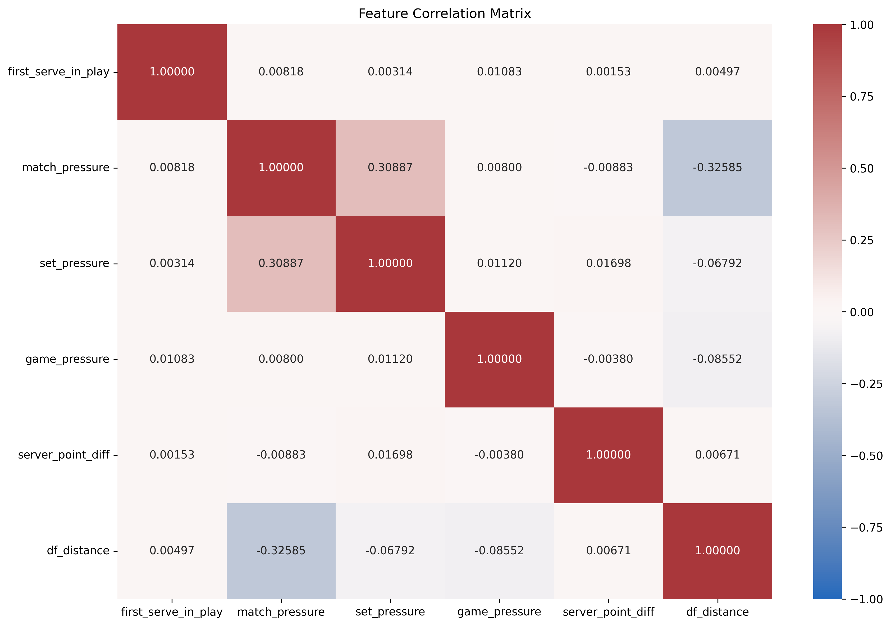

# Modeling Tennis Match Dynamics with Hidden Markov Models

**Author(s):** Your Name(s)  
**Institution / Course / Date**

---

## 1. Motivation

Tennis matches evolve point-by-point, but underlying “momentum” or pressure states are not directly observable.  
This project uses statistical modeling to uncover hidden match dynamics and understand how match context evolves over time.

---

## 1. Data Overview

All data was collected or downloaded using Jeff Sackmann's **TennisAbstract** *(https://tennisabstract.com/)* project.

**Dataset Summary**
**Point(s):** ~1.5 million points
**Date Range:** 2000 to 2026 *(current)*

**Feature Variables**

| Feature | Meaning |
|--------|--------|
| **first_serve_in_play** | Whether first serve was successful |
| **server_point_diff** | Score difference |
| **game_pressure** | Pressure within the game |
| **set_pressure** | Pressure within the set |
| **match_pressure** | Overall match pressure |
| **df_distance** | Points since last double fault in current match |

**Note:**  
All features were standardized (mean = 0, std = 1) for comparability.

---

## 2. Relationships Between Variables

To evaluate whether the model inputs provide overlapping or independent information, we compute pairwise correlations between all features. This helps determine whether the feature set is appropriate for multivariate modeling (e.g., Hidden Markov Models).

### Correlation Matrix

### Interpretation

The low overall correlation suggests that each feature captures distinct aspects of match dynamics. This supports their use as inputs in a multivariate Hidden Markov Model.

---

## 5. Temporal Behavior (Autocorrelation)

| Feature | Lag 1 | Lag 50 | Interpretation |
|--------|------|--------|---------------|
| match_pressure | 0.98 | 0.10 | Very persistent |
| set_pressure | 0.92 | 0.13 | Strong carryover |
| df_distance | 0.84 | 0.12 | Smooth changes |
| game_pressure | 0.51 | ~0.00 | Moderate memory |
| server_point_diff | 0.56 | ~0.00 | Moderate memory |
| first_serve_in_play | 0.04 | ~0.00 | Nearly random |

**Takeaway:**  
- Pressure variables evolve slowly  
- Serve success behaves almost randomly

## 7. Model Selection

Models evaluated with different numbers of hidden states.

**Criteria:**
- AIC (Akaike Information Criterion)
- BIC (Bayesian Information Criterion)

| States | AIC | BIC |
|-------|-----|-----|
| 2 | ... | ... |
| 3 | ... | ... |
| 4 | ... | ... |
| 5 | ... | ... |

**Selected Model:**  
Optimal number of states = **X**

---

## 8. Hidden State Interpretation

| State | Characteristics |
|------|----------------|
| State 0 | Low pressure, stable |
| State 1 | High pressure |
| State 2 | Transitional / volatile |
| State 3 | Extreme conditions |

*(Replace with actual model outputs)*

---

## 9. Transition Dynamics

- Transition matrix shows probabilities of moving between states

**Key Observations:**
- High diagonal values → states persist
- Transitions occur gradually

**Interpretation:**  
Matches tend to remain in the same underlying condition for multiple points.

---

## 10. Baseline Comparison

### Logistic Regression (Baseline)
- Uses same features
- No temporal modeling

### Why Compare?
Demonstrates whether temporal modeling (HMM) improves performance.

**Metrics to Include:**
- Accuracy / AUC / Log-Likelihood

---

## 11. Key Insights

- Match pressure evolves **slowly and predictably**
- Serve success is **nearly random**
- Hidden states capture **distinct match conditions**
- Temporal modeling provides **additional structure**

---

## 12. Limitations

- Missing or noisy data (serve outcomes)
- Gaussian assumption for emissions
- Hidden states may not map directly to real-world concepts

---

## 13. Future Work

- Use **GMM-HMM** for more flexible distributions
- Add player-specific features
- Incorporate rally-level data
- Predict match outcomes (win probability)

---

## 14. Appendix (Optional)

### Additional Details
- HMM components:
  - Transition matrix (A)
  - Emission distributions
- Model assumptions
- Additional plots:
  - ACF graphs
  - Feature distributions

---